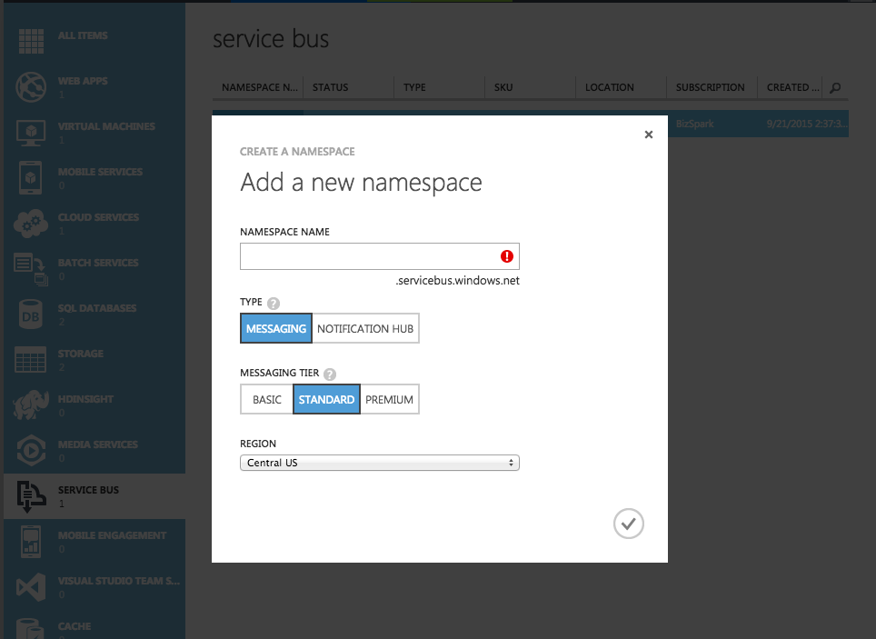
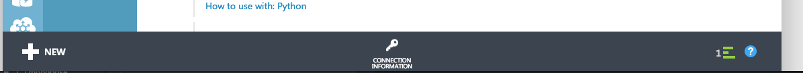
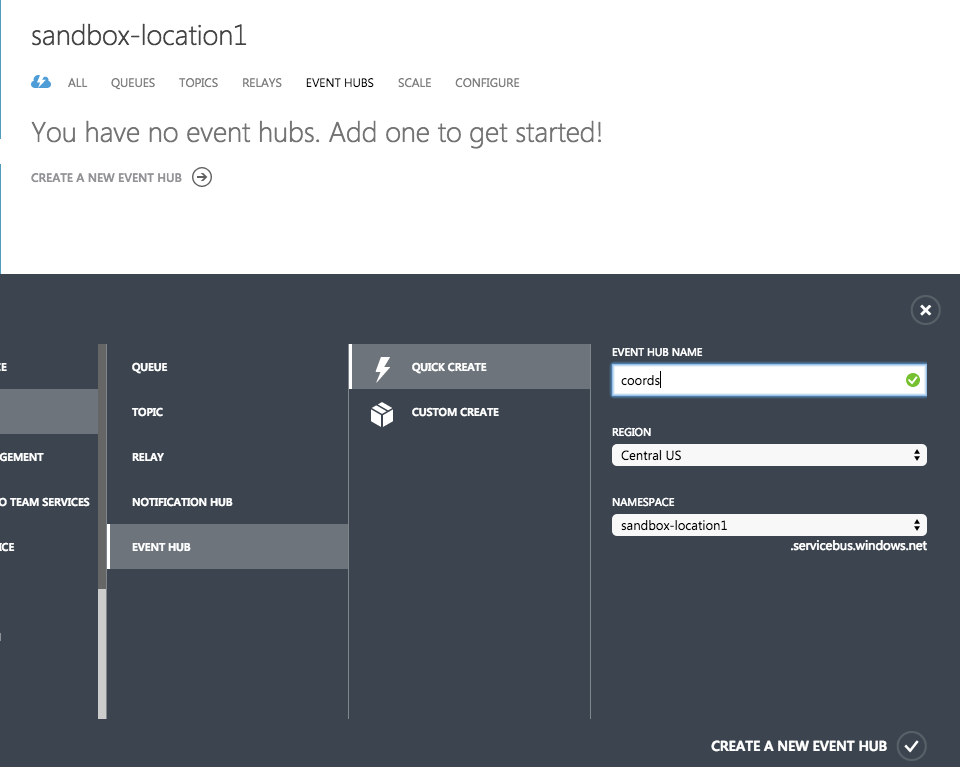
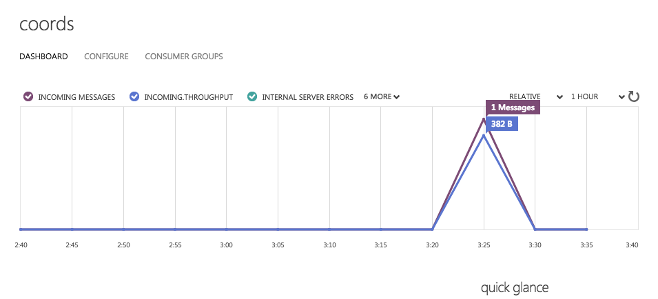

Setting up your Particle Webhook to Azure Service Bus
===

1.) Login to youre Azure portal:

    https://manage.windowsazure.com
    
2.) Setup a messaging Service Bus and remember the name, in this case we're using "sandbox-location1"



3.) It should automatically open the window for the new Service Bus.
Click on the connection Information button at the bottom, and copy out that connection string.




```
    Endpoint=sb://__YOUR_NAMESPACE__.servicebus.windows.net/;
    SharedAccessKeyName=RootManageSharedAccessKey;
    SharedAccessKey=__YOUR_SERVICE_BUS_KEY__
```

4.) Click on "EVENT HUBS" under your new Service Bus.  Quick Create a new Event Hub, in this case "coords".


5.) Open up location.json, the example webhook configuration file.  Change the azure_sas_token key to your new key from
the info you found above.  Replace "YOUR_PROJECT_NAME" with the namespace of your Service Bus, in this case, 
"sandbox-location1".  Set "YOUR_BUS_NAME" to "coords" or whatever you named your Event Hub.

6.) Create the webhook

```
    particle webhook create location.json
```

You should see something like this:

```
$ particle webhook create scratch.json 
Using settings from the file location.json
Sending webhook request  { uri: '/v1/webhooks',
  method: 'POST',
  json: 
   { event: 'GPS_coords',
     url: 'https://__YOUR_PROJECT_NAME__.servicebus.windows.net/__YOUR_EVENT_HUB_NAME___/messages',
     deviceid: undefined,
     requestType: 'POST',
     mydevices: true,
     eventName: 'GPS_coords',
     json: 
      { latitude: '{{lat}}',
        longitude: '{{lon}}',
        altitude: '{{a}}',
        quality: '{{q}}',
        satellites: '{{s}}',
        battery_vcc: '{{vcc}}',
        battery_soc: '{{soc}}',
        published_at: '{{SPARK_PUBLISHED_AT}}',
        coreid: '{{SPARK_CORE_ID}}' },
     azure_sas_token: 
      { key_name: 'RootManageSharedAccessKey',
        key: '__YOUR_AZURE_KEY__' },
     nodefaults: true },
  headers: { Authorization: 'Bearer ABC123' } }
Successfully created webhook with ID DEF456

```


7.) If your Electron / Asset Tracker shield is running your new code, and your hook is active, you should see the following in your event stream:

```
$ particle subscribe mine

Subscribing to all events from my personal stream (my devices only) 
Listening to: /v1/devices/events
{"name":"GPS_coords","data":"{\"lat\": 44.1234,\"lon\": -93.1234,\"a\": 297.200012,\"q\": 1,\"s\": 4,\"vcc\": 4.014600,\"soc\": 90.222656}","ttl":"60","published_at":"2016-02-22T21:28:25.573Z","coreid":"270051000a51343334361234"}
{"name":"hook-sent/GPS_coords","data":"undefined","ttl":"60","published_at":"2016-02-22T21:28:26.356Z","coreid":"particle-internal"}

```

8.) You won't see a hook-response since Azure didn't send anything back.  It might take 10-15 minutes for the Event Hubs dashboard to update, but you
should eventually see the events arriving:

